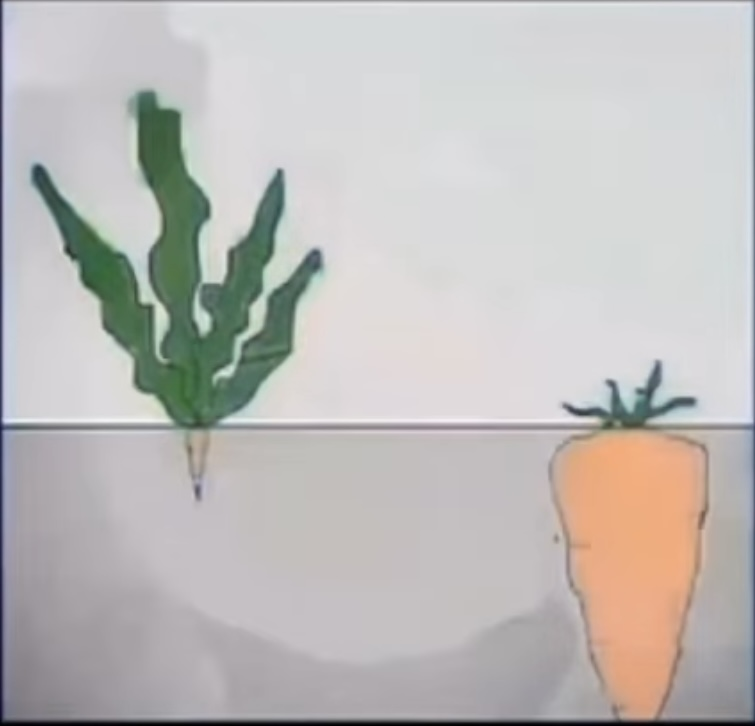
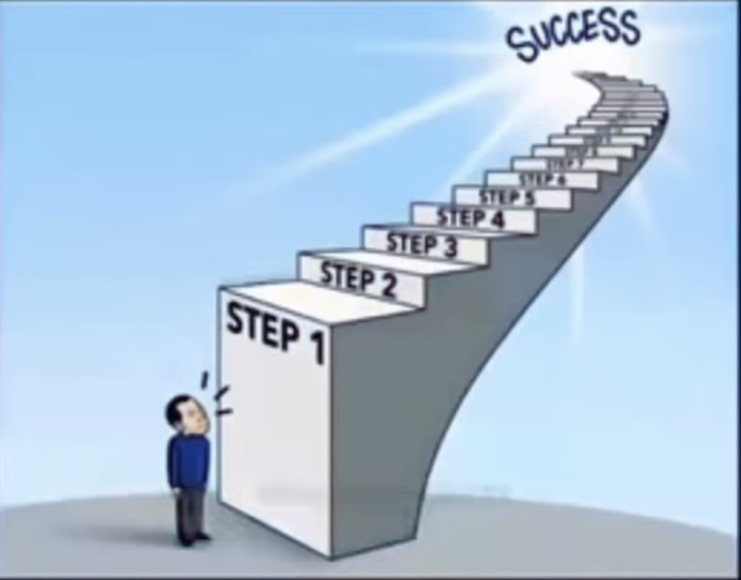
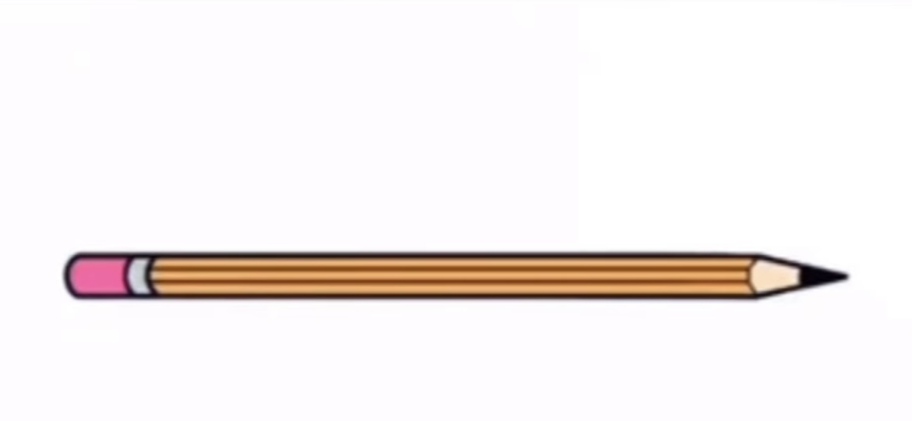
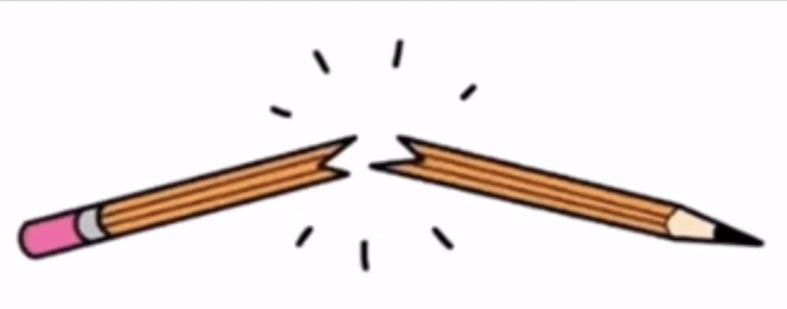
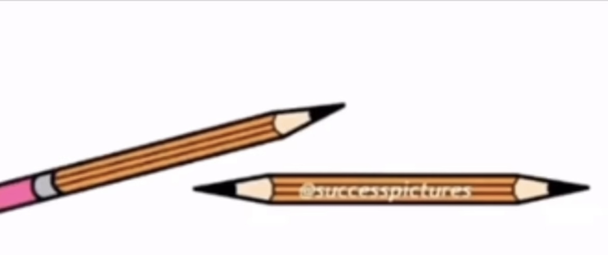
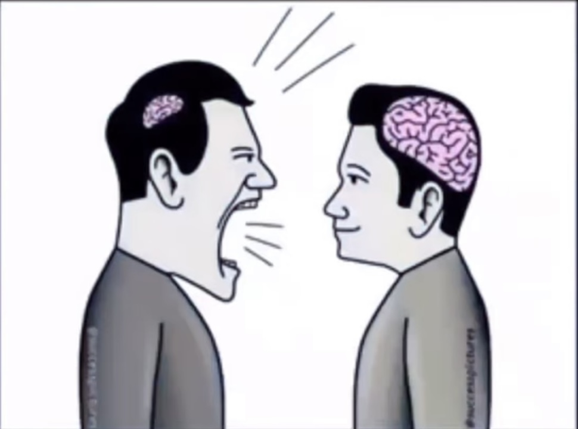

## Top Motivational Pictures with Deep Meaning (Try Not to Cry):

Never assume in life. Don't think that carrot big because carrot big leaf, because small leaf carrot big not leaf big size.

Sometime, on way to successful, first of steps of all of the steps to being successful steps are hardest of all of the steps to successing. Steps.

Just because everyone person going in one directional way, does not meaning you are going to the directional direction to which every person which is going in. Go in your own indepenedent in which way you are going in.

Sometime in live, everything pencil and everything smoothly with pencil is going smootly. But then...

Unexpected happening, it is happening unexpectedly in life.

The importance thing to do is to make solution to problem so problem is solutioned problem solution problem.

Chair.

The more you know are knowing what you are knowing and more your brain size and your head size big, the less you need to say to talk in argument with other peoples with smaller brain head shouting.

Thank you for watching. Make sure to like the video if you cried, and comment your favorite motivational picture.